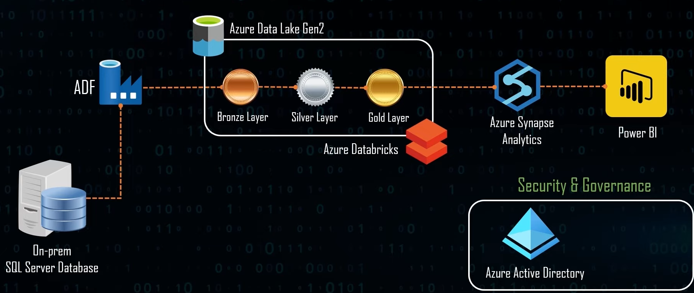

# End-to-End Data Engineering Project Using Azure Technologies

This repository demonstrates a comprehensive real-time **Data Engineering Project** using various **Azure technologies**. The project is structured to provide a detailed understanding of how to utilize different Azure services to design and build a fully operational data engineering pipeline. It's particularly useful for professionals preparing for **Azure Data Engineering** interviews or looking to include a real-world project on their resumes.

---

## **Project Overview:**
The goal is to migrate data from an **on-premise SQL Server** database to the **Azure cloud**, transform it, and analyze it using popular Azure tools. The project follows a typical **data lakehouse architecture**, leveraging **Azure Data Factory**, **Azure Databricks**, **Azure Synapse Analytics**, **Azure Data Lake Gen2**, and **Power BI** to handle different stages of data ingestion, transformation, storage, and reporting.

## **Use Case: On-Premise SQL Database Migration**
The project simulates one of the most common real-world scenarios: **migrating an on-premise SQL Server database to the cloud**. The database consists of six or seven tables, which are copied to **Azure Data Lake Gen2** using **Azure Data Factory**.

---

### **Architecture Workflow:**
1. **Data Ingestion**:
   - Using **Azure Data Factory**, data from the on-premise SQL Server is ingested and stored in the **Bronze layer** of the Azure Data Lake.

2. **Bronze, Silver, and Gold Layers**:
   - The **Bronze layer** holds raw data, serving as the **source of truth**.
   - Data transformations occur in the **Silver layer**, where basic modifications such as renaming columns and changing data types are performed using **Azure Databricks**.
   - The **Gold layer** contains the clean, curated data, ready for analytics and reporting.

3. **Data Transformation**:
   - **Azure Databricks** is used to perform various data transformations using **PySpark**. The code modifies the raw data into usable, cleaned data that can be further processed.

4. **Data Loading**:
   - The final transformed data from the **Gold layer** is loaded into **Azure Synapse Analytics**, where a database and tables are created to store the data.

5. **Data Reporting**:
   - Using **Power BI**, reports are created based on the clean data stored in **Azure Synapse Analytics**, visualizing insights through charts, dashboards, and various other data representation formats.

6. **Security and Governance**:
   - **Azure Active Directory (AAD)** manages identity and access control.
   - **Azure Key Vault** is used for securely storing sensitive information like connection strings and passwords.

7. **Automation**:
   - Pipelines are automated such that when new rows are added to the on-premise database, the entire pipeline—data ingestion, transformation, and reporting—executes to reflect the updates in Power BI in real-time.

---

### **Task Covered in the Project:**
- Environment Setup – Configuring Azure resources (Data Factory, Data Lake, etc.).
- Data Ingestion – Ingesting on-premise SQL data into the **Bronze layer** of the data lake.
- Data Transformation – Using **Azure Databricks** to perform transformations from **Bronze to Silver** and **Silver to Gold**.
- Data Loading – Loading the final transformed data into **Azure Synapse Analytics**.
- Data Reporting – Creating reports using **Power BI**.
- End-to-End Pipeline Testing – Ensuring the pipeline works from ingestion to reporting.

---

### **Key Concepts Covered:**
- **Data Lakehouse Architecture**: Understanding the **Bronze**, **Silver**, and **Gold** layers for data storage and transformation.
- **Real-Time Data Engineering**: Building a pipeline that responds to real-time data updates.
- **Azure Integration**: How to seamlessly use Azure services to build a scalable and secure data engineering solution.
- **Power BI Integration**: Creating effective reports and dashboards.

---

### **Useful for:**
- Data Engineers looking to enhance their skills with Azure tools.
- Professionals preparing for data engineering interviews.
- Anyone looking to understand real-world use cases for data lakehouse architectures in Azure.
  
---

### **References:**
- YouTube Channel: **Mr. K Talks Tech**
